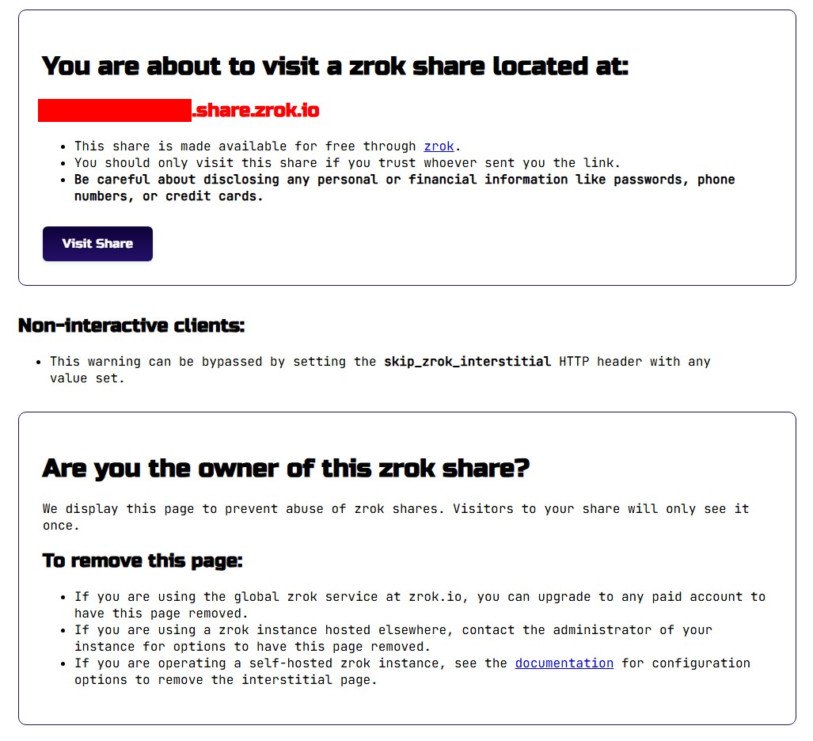
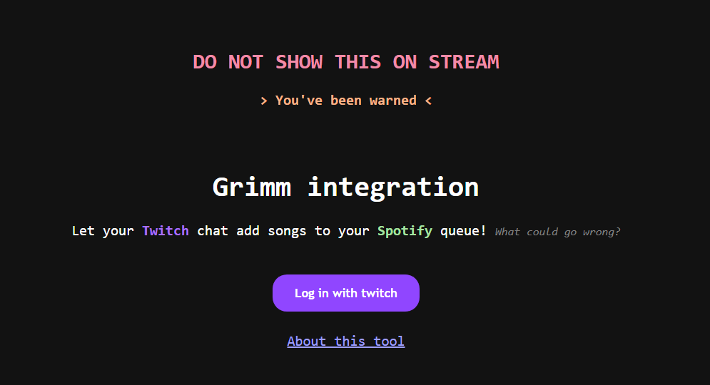
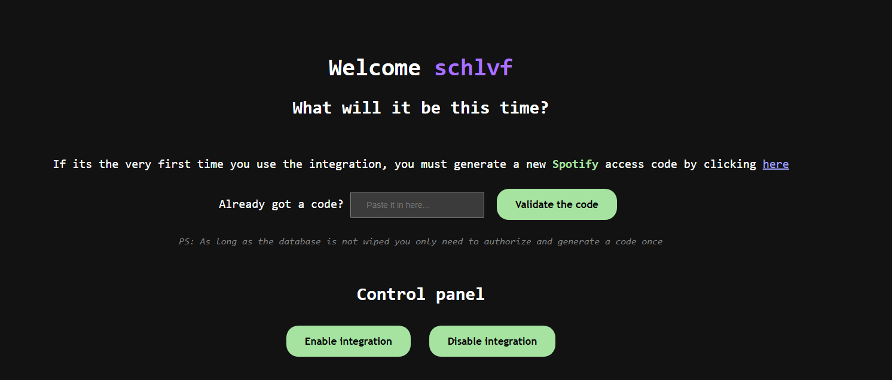
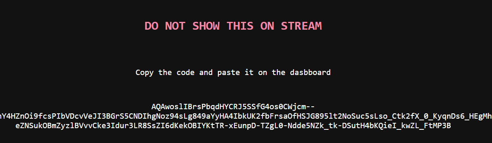
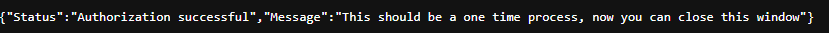

# The ~~not so~~ detailed usage guide

## Before you move on

1. You're supposed to have completed the [setup guide](setup_guide.md) for things to make sense here

2. Things may change visually in the future, so don't be surprised if what you see whenever you read this doesn't look exactly the same to what this guide shows you, just keep in mind that everything will work pretty much the same

3. This guide is a work in progress and will only cover the basics to make use of the Spotify integration

## First steps

Assuming that you completed the setup correctly you should now have multiple docker containers, so let's explain them briefly:

|Container name|Port|Is exposed?|What it does|
|-|-|-|-|
|`grimm-redis`|6379|No|This is the cache-like-storage that our tool uses to save all the information that it needs to operate like the Oauth2 tokens|
|`grimm-api`|8000|No|This is the backend that allows interactions with Twitch and Spotify. You can find the OpenAPI documentation in the `/docs` route|
|`zrok-init`|n/a|No|This is the component that initializes the Zrok environment. When the docker compose is run, it will start to ensure everything Zrok related works and then shuts down the container|
|`zrok-enable`|n/a|No|Similar to zrok-init, this is a component that only runs at the start to enable the Zrok environment and then shuts down the container|
|`zrok-share`|443|Yes|This is the zrok instance that acts as an entrypoint for the API by creating a virtual tunnel to a reserved zrok url|

As long as you use the **non-dev** `docker-compose.yml` only the zrok-share container will be exposed to the internet, meaning that this will act as a middleware for every request or interaction with the API

If you check the logs of the `zrok-share` container for the very first time you should be able to find something like this:

```text
DEBUG: zrok state directory is /mnt/.zrok
DEBUG: ZROK_SHARE_RESERVED=true
WARNING: STATE_DIRECTORY is undefined. Using HOME=/mnt
INFO: running: zrok share reserved <the_name_you_reserved> --override-endpoint http://grimm-api:8000⁠ --headless
[   0.804]    INFO main.(*shareReservedCommand).shareLocal: sharing target: 'http://grimm-api:8000'
[   0.804]    INFO main.(*shareReservedCommand).shareLocal: using existing backend target: http://grimm-api:8000⁠
[   1.997]    INFO sdk-golang/ziti.(*listenerManager).createSessionWithBackoff: {session token=[d6a81-76be-4089-9fd7-398d67d]} new service session
[   2.509]    INFO main.(*shareReservedCommand).shareLocal: access your zrok share: https://<the_name_you_reserved>.share.zrok.io⁠
```

If you see something similar, congratulations, it means that Zrok is working as intended, and to further confirm this, you can go to the URL that was displayed there to access the frontend of our tool

If you don't know how to check the logs, it will be the same url we put in the `.env` file during the setup guide for the `app_subdomain` key

Example: `https://<the_name_you_reserved>.share.zrok.io⁠`

Unless you're on a paid Zrok plan, once you visit the URL for the very first time, you will see something like this:



To move forward to the Dashboard simply click on the purple button that says `Visit Share`, and once there you will see something like this:



From here onwards everything will be pretty intuitive and self explanatory so don't be afraid and just fiddle around, **just make sure that you do not show it on stream for obvious reasons**

## The dashboard

Before you can use anything in the site you will need to authorize the tool by logging in with Twitch. This will redirect you to the official Twitch authorization site so please read and follow the steps they indicate you to do

Once you've logged in with your Twitch account you will see something like this:



From here you will be able to authorize Spotify and enable or disable the channel point redeem, but assuming it's the first time you're here, you can follow the steps below to leave everything functional

### 1. Authorize Spotify

To authorize Spotify we must first generate the access code that our API will use to be able to add songs to your queue. To do so, click on the underlined text or button as indicated in the Dashboard

Doing so will open a window similar to this:



Now copy and paste the entire code that was given to you, close the window and paste it in the text input that was in the middle of the Dashboard, and finally click on `Validate the code`

If everything worked as intended a new tab will open and you will see something like this:



If you're wondering why it looks ugly and different from the rest of the site is because this was implemented as a last minute thing so anyone using the tool could get an idea of what happened after a certain action, and since it's supposed to be a one-time thing I didn't bother making a proper UI for it

Again, this may change in the future, but at the time this guide is being written, that is not a thing yet

Now that Spotify has been authorized you can close that window and go back to the Dashboard

### 2. Creating and enabling the channel point redemption

To enable the channel point redemption simply click the button in the Dashboard that says `Enable integration`

Doing so not only will create a new channel point redemption in your Twitch channel in case there wasn't one already but will also make it so the API listens to it, so when a chatter redeems it and provides a Spotify track URL, it will automatically add the track to your current queue if you're playing anything

There are a few things to point out here:

1. You should make sure to not have 50 channel point redeems already created in your channel since Twitch won't allow you to exceed the amount and will prevent the tool from making one

2. When the tool creates the redeem for the very first time it will be named `Spotify song request`. Please make sure to not change the name since the tool uses it to know if the redeem already exists or not

3. The tool can and will refund automatically the channel points of those redemptions that were unsuccessful only if the channel point redemption was made using the Dashboard. If you create the redemption manually, it won't be able to refund points since it won't have the ownership permissions for it

4. If the tool was shutdown for an N amount of time and during that time someone used the redemption, Twitch won't get the response that it needs to know that the tool got the message and will disable the interactions in between both the tool and Twitch, meaning that you will have to click again the `Enable integration` button before the integration can work again\
To avoid this, it is recommended to run the tool in a server or a machine that can be available 24/7

Finally, to disable the integration all you need to do is click on the `Disable integration` button. This will also hide the channel point redemption from your channel so it can't be used by anyone but it won't be deleted
